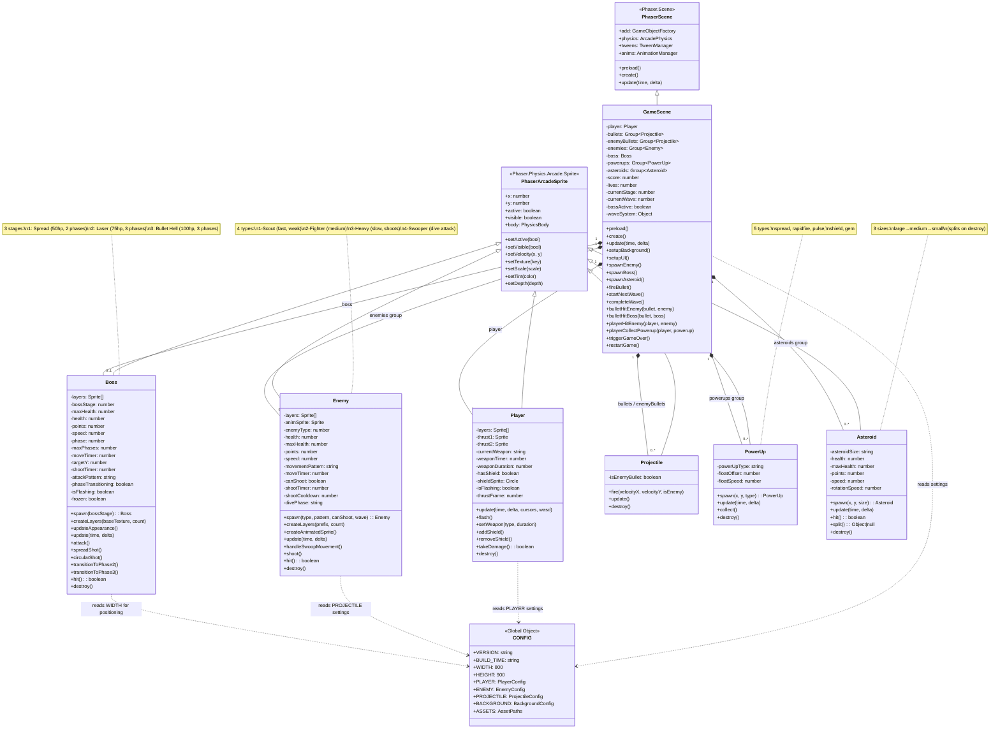

# Xario Game - Class Diagram

```mermaid
classDiagram
    direction TB

    class PhaserArcadeSprite {
        <<Phaser.Physics.Arcade.Sprite>>
        +x: number
        +y: number
        +active: boolean
        +visible: boolean
        +body: PhysicsBody
        +setActive(bool)
        +setVisible(bool)
        +setVelocity(x, y)
        +setTexture(key)
        +setScale(scale)
        +setTint(color)
        +setDepth(depth)
    }

    class PhaserScene {
        <<Phaser.Scene>>
        +add: GameObjectFactory
        +physics: ArcadePhysics
        +tweens: TweenManager
        +anims: AnimationManager
        +preload()
        +create()
        +update(time, delta)
    }

    class CONFIG {
        <<Global Object>>
        +VERSION: string
        +BUILD_TIME: string
        +WIDTH: 800
        +HEIGHT: 900
        +PLAYER: PlayerConfig
        +ENEMY: EnemyConfig
        +PROJECTILE: ProjectileConfig
        +BACKGROUND: BackgroundConfig
        +ASSETS: AssetPaths
    }

    class GameScene {
        -player: Player
        -bullets: Group~Projectile~
        -enemyBullets: Group~Projectile~
        -enemies: Group~Enemy~
        -boss: Boss
        -powerups: Group~PowerUp~
        -asteroids: Group~Asteroid~
        -score: number
        -lives: number
        -currentStage: number
        -currentWave: number
        -bossActive: boolean
        -waveSystem: Object
        +preload()
        +create()
        +update(time, delta)
        +setupBackground()
        +setupUI()
        +spawnEnemy()
        +spawnBoss()
        +spawnAsteroid()
        +fireBullet()
        +startNextWave()
        +completeWave()
        +bulletHitEnemy(bullet, enemy)
        +bulletHitBoss(bullet, boss)
        +playerHitEnemy(player, enemy)
        +playerCollectPowerup(player, powerup)
        +triggerGameOver()
        +restartGame()
    }

    class Player {
        -layers: Sprite[]
        -thrust1: Sprite
        -thrust2: Sprite
        -currentWeapon: string
        -weaponTimer: number
        -weaponDuration: number
        -hasShield: boolean
        -shieldSprite: Circle
        -isFlashing: boolean
        -thrustFrame: number
        +update(time, delta, cursors, wasd)
        +flash()
        +setWeapon(type, duration)
        +addShield()
        +removeShield()
        +takeDamage(): boolean
        +destroy()
    }

    class Enemy {
        -layers: Sprite[]
        -animSprite: Sprite
        -enemyType: number
        -health: number
        -maxHealth: number
        -points: number
        -speed: number
        -movementPattern: string
        -moveTimer: number
        -canShoot: boolean
        -shootTimer: number
        -shootCooldown: number
        -divePhase: string
        +spawn(type, pattern, canShoot, wave): Enemy
        +createLayers(prefix, count)
        +createAnimatedSprite()
        +update(time, delta)
        +handleSwoopMovement()
        +shoot()
        +hit(): boolean
        +destroy()
    }

    class Boss {
        -layers: Sprite[]
        -bossStage: number
        -maxHealth: number
        -health: number
        -points: number
        -speed: number
        -phase: number
        -maxPhases: number
        -moveTimer: number
        -targetY: number
        -shootTimer: number
        -attackPattern: string
        -phaseTransitioning: boolean
        -isFlashing: boolean
        -frozen: boolean
        +spawn(bossStage): Boss
        +createLayers(baseTexture, count)
        +updateAppearance()
        +update(time, delta)
        +attack()
        +spreadShot()
        +circularShot()
        +transitionToPhase2()
        +transitionToPhase3()
        +hit(): boolean
        +destroy()
    }

    class Projectile {
        -isEnemyBullet: boolean
        +fire(velocityX, velocityY, isEnemy)
        +update()
        +destroy()
    }

    class PowerUp {
        -powerUpType: string
        -floatOffset: number
        -floatSpeed: number
        +spawn(x, y, type): PowerUp
        +update(time, delta)
        +collect()
        +destroy()
    }

    class Asteroid {
        -asteroidSize: string
        -health: number
        -maxHealth: number
        -points: number
        -speed: number
        -rotationSpeed: number
        +spawn(x, y, size): Asteroid
        +update(time, delta)
        +hit(): boolean
        +split(): Object|null
        +destroy()
    }

    %% Inheritance
    PhaserScene <|-- GameScene
    PhaserArcadeSprite <|-- Player
    PhaserArcadeSprite <|-- Enemy
    PhaserArcadeSprite <|-- Boss
    PhaserArcadeSprite <|-- Projectile
    PhaserArcadeSprite <|-- PowerUp
    PhaserArcadeSprite <|-- Asteroid

    %% Composition - GameScene owns all entities
    GameScene "1" *-- "1" Player : player
    GameScene "1" *-- "0..*" Enemy : enemies group
    GameScene "1" *-- "0..1" Boss : boss
    GameScene "1" *-- "0..*" Projectile : bullets / enemyBullets
    GameScene "1" *-- "0..*" PowerUp : powerups group
    GameScene "1" *-- "0..*" Asteroid : asteroids group

    %% Dependencies
    GameScene ..> CONFIG : reads settings
    Player ..> CONFIG : reads PLAYER settings
    Enemy ..> CONFIG : reads PROJECTILE settings
    Boss ..> CONFIG : reads WIDTH for positioning

    %% Enemy types annotation
    note for Enemy "4 types:\n1-Scout (fast, weak)\n2-Fighter (medium)\n3-Heavy (slow, shoots)\n4-Swooper (dive attack)"

    %% Boss stages annotation
    note for Boss "3 stages:\n1: Spread (50hp, 2 phases)\n2: Laser (75hp, 3 phases)\n3: Bullet Hell (100hp, 3 phases)"

    %% PowerUp types annotation
    note for PowerUp "5 types:\nspread, rapidfire, pulse,\nshield, gem"

    %% Asteroid sizes annotation
    note for Asteroid "3 sizes:\nlarge→medium→small\n(splits on destroy)"
```
