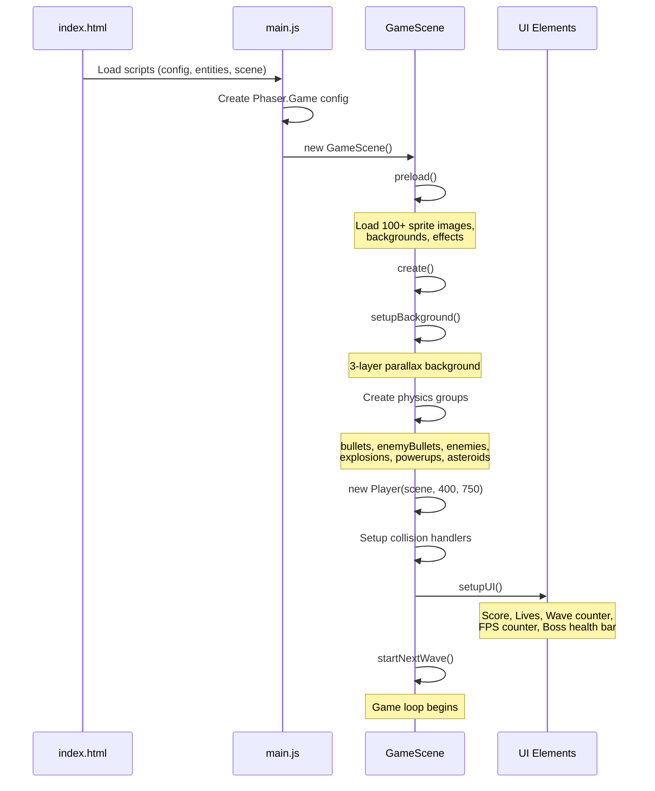
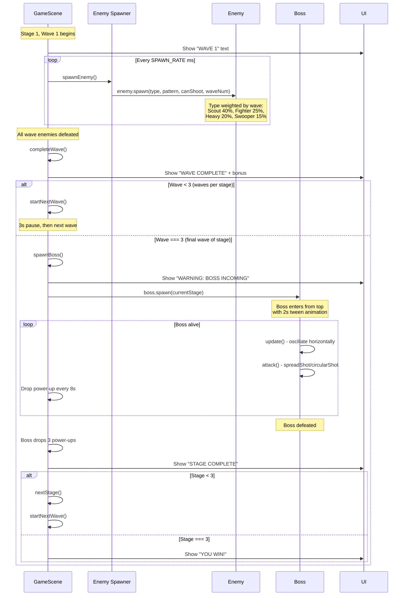
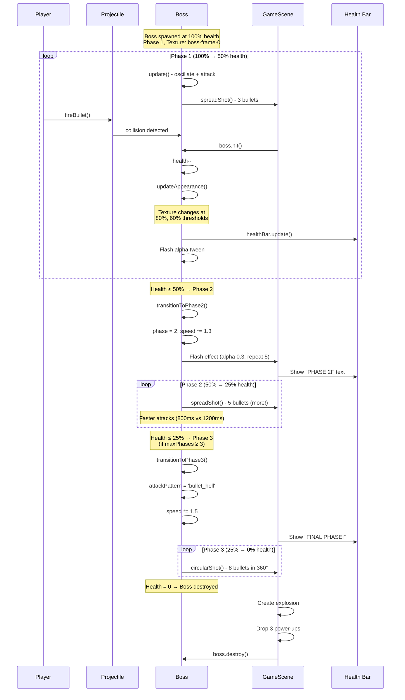
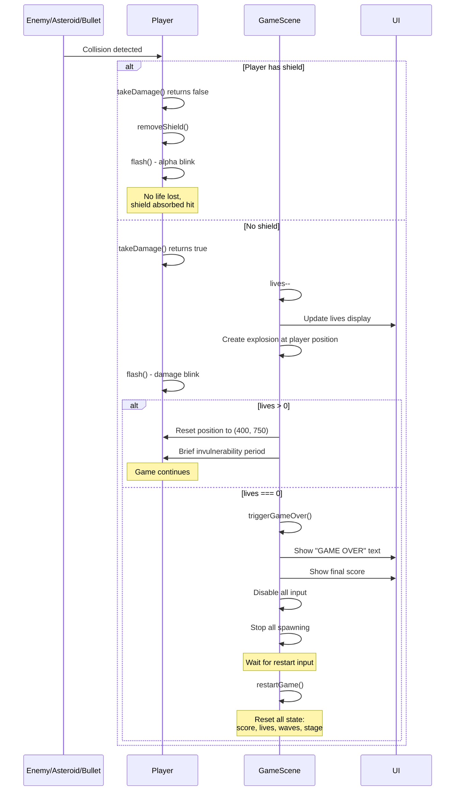
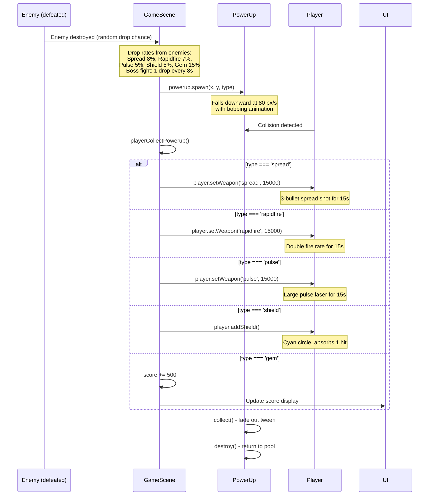

# Xario Game - Sequence Diagrams

## 1. Game Startup Flow

```mermaid
sequenceDiagram
    participant HTML as index.html
    participant Main as main.js
    participant GS as GameScene
    participant UI as UI Elements

    HTML->>Main: Load scripts (config, entities, scene)
    Main->>Main: Create Phaser.Game config
    Main->>GS: new GameScene()

    GS->>GS: preload()
    Note over GS: Load 100+ sprite images,<br/>backgrounds, effects

    GS->>GS: create()
    GS->>GS: setupBackground()
    Note over GS: 3-layer parallax background

    GS->>GS: Create physics groups
    Note over GS: bullets, enemyBullets, enemies,<br/>explosions, powerups, asteroids

    GS->>GS: new Player(scene, 400, 750)
    GS->>GS: Setup collision handlers
    GS->>UI: setupUI()
    Note over UI: Score, Lives, Wave counter,<br/>FPS counter, Boss health bar

    GS->>GS: startNextWave()
    Note over GS: Game loop begins
```

## 2. Wave Progression

```mermaid
sequenceDiagram
    participant GS as GameScene
    participant ES as Enemy Spawner
    participant E as Enemy
    participant B as Boss
    participant UI as UI

    Note over GS: Stage 1, Wave 1 begins
    GS->>UI: Show "WAVE 1" text

    loop Every SPAWN_RATE ms
        GS->>ES: spawnEnemy()
        ES->>E: enemy.spawn(type, pattern, canShoot, waveNum)
        Note over E: Type weighted by wave:<br/>Scout 40%, Fighter 25%,<br/>Heavy 20%, Swooper 15%
    end

    Note over GS: All wave enemies defeated

    GS->>GS: completeWave()
    GS->>UI: Show "WAVE COMPLETE" + bonus

    alt Wave < 3 (waves per stage)
        GS->>GS: startNextWave()
        Note over GS: 3s pause, then next wave
    else Wave === 3 (final wave of stage)
        GS->>GS: spawnBoss()
        GS->>UI: Show "WARNING: BOSS INCOMING"
        GS->>B: boss.spawn(currentStage)
        Note over B: Boss enters from top<br/>with 2s tween animation

        loop Boss alive
            B->>B: update() - oscillate horizontally
            B->>B: attack() - spreadShot/circularShot
            GS->>GS: Drop power-up every 8s
        end

        Note over B: Boss defeated
        GS->>GS: Boss drops 3 power-ups
        GS->>UI: Show "STAGE COMPLETE"

        alt Stage < 3
            GS->>GS: nextStage()
            GS->>GS: startNextWave()
        else Stage === 3
            GS->>UI: Show "YOU WIN!"
        end
    end
```

## 3. Boss Battle (Phase Transitions)

```mermaid
sequenceDiagram
    participant P as Player
    participant Proj as Projectile
    participant B as Boss
    participant GS as GameScene
    participant UI as Health Bar

    Note over B: Boss spawned at 100% health<br/>Phase 1, Texture: boss-frame-0

    loop Phase 1 (100% → 50% health)
        B->>B: update() - oscillate + attack
        B->>GS: spreadShot() - 3 bullets
        P->>Proj: fireBullet()
        Proj->>B: collision detected
        GS->>B: boss.hit()
        B->>B: health--
        B->>B: updateAppearance()
        Note over B: Texture changes at<br/>80%, 60% thresholds
        B->>UI: healthBar.update()
        B->>B: Flash alpha tween
    end

    Note over B: Health ≤ 50% → Phase 2

    B->>B: transitionToPhase2()
    B->>B: phase = 2, speed *= 1.3
    B->>GS: Flash effect (alpha 0.3, repeat 5)
    GS->>UI: Show "PHASE 2!" text

    loop Phase 2 (50% → 25% health)
        B->>GS: spreadShot() - 5 bullets (more!)
        Note over B: Faster attacks (800ms vs 1200ms)
    end

    Note over B: Health ≤ 25% → Phase 3<br/>(if maxPhases ≥ 3)

    B->>B: transitionToPhase3()
    B->>B: attackPattern = 'bullet_hell'
    B->>B: speed *= 1.5
    GS->>UI: Show "FINAL PHASE!"

    loop Phase 3 (25% → 0% health)
        B->>GS: circularShot() - 8 bullets in 360°
    end

    Note over B: Health = 0 → Boss destroyed
    GS->>GS: Create explosion
    GS->>GS: Drop 3 power-ups
    GS->>B: boss.destroy()
```

## 4. Player Hit / Game Over

```mermaid
sequenceDiagram
    participant E as Enemy/Asteroid/Bullet
    participant P as Player
    participant GS as GameScene
    participant UI as UI

    E->>P: Collision detected

    alt Player has shield
        P->>P: takeDamage() returns false
        P->>P: removeShield()
        P->>P: flash() - alpha blink
        Note over P: No life lost,<br/>shield absorbed hit
    else No shield
        P->>P: takeDamage() returns true
        GS->>GS: lives--
        GS->>UI: Update lives display
        GS->>GS: Create explosion at player position
        P->>P: flash() - damage blink

        alt lives > 0
            GS->>P: Reset position to (400, 750)
            GS->>P: Brief invulnerability period
            Note over P: Game continues
        else lives === 0
            GS->>GS: triggerGameOver()
            GS->>UI: Show "GAME OVER" text
            GS->>UI: Show final score
            GS->>GS: Disable all input
            GS->>GS: Stop all spawning

            Note over GS: Wait for restart input

            GS->>GS: restartGame()
            Note over GS: Reset all state:<br/>score, lives, waves, stage
        end
    end
```

## 5. Power-Up Collection

```mermaid
sequenceDiagram
    participant E as Enemy (defeated)
    participant GS as GameScene
    participant PU as PowerUp
    participant P as Player

    E->>GS: Enemy destroyed (random drop chance)
    Note over GS: Drop rates from enemies:<br/>Spread 8%, Rapidfire 7%,<br/>Pulse 5%, Shield 5%, Gem 15%<br/>Boss fight: 1 drop every 8s

    GS->>PU: powerup.spawn(x, y, type)
    Note over PU: Falls downward at 80 px/s<br/>with bobbing animation

    P->>PU: Collision detected
    GS->>GS: playerCollectPowerup()

    alt type === 'spread'
        GS->>P: player.setWeapon('spread', 15000)
        Note over P: 3-bullet spread shot for 15s
    else type === 'rapidfire'
        GS->>P: player.setWeapon('rapidfire', 15000)
        Note over P: Double fire rate for 15s
    else type === 'pulse'
        GS->>P: player.setWeapon('pulse', 15000)
        Note over P: Large pulse laser for 15s
    else type === 'shield'
        GS->>P: player.addShield()
        Note over P: Cyan circle, absorbs 1 hit
    else type === 'gem'
        GS->>GS: score += 500
        GS->>UI: Update score display
    end

    PU->>PU: collect() - fade out tween
    PU->>PU: destroy() - return to pool
```
